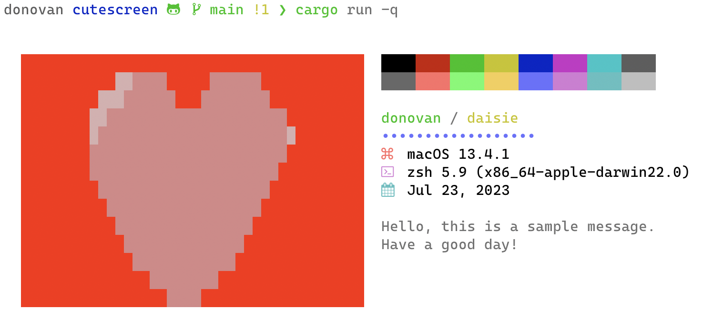

# **cutescreen**

cutescreen is a terminal welcome screen program written in rust.



## **Table of Contents**

[Usage](#USAGE)

1. [Getting Started](#GETTING-STARTED)
1. [Commands](#COMMANDS)

[Configurations](#CONFIGURATIONS)

1. [Colors](#COLORS)

---

## [Usage](#USAGE)

### [**Getting Started**](#GETTING-STARTED)

To ensure cutescreen loads each time your shell is opened you must export it in your shell configuration file (`.zshrc`, `.bashrc`, `.bash_profile`, typically found in your `$HOME` directory).

```zsh
export PATH="$PATH:$HOME/cutescreen/bin"
cutescreen
```

### [**Commands**](#COMMANDS)

| **Command**           | **Definition**                                                |
| --------------------- | ------------------------------------------------------------- |
| `$ cutescreen`        | will print the welcome screen to terminal                     |
| `$ cutescreen config` | will open configuration file in preferred text editor         |
| `$ cutescreen reset`  | will reset the program to factory settings                    |
| `$ cutescreen create` | will open the cutescreen pixel editor in your default browser |
| `$ cutescreen help`   | will print a list of supported commands                       |

---

## [Configurations](#CONFIGURATIONS)

This program is configurable to tailor your own welcome screen. See an example of the configuration fields below:

```yaml
formats:
  current_date_time_format: "%b %d, %Y"
displays:
  should_display_image: true
  should_display_blocks: true
  should_display_text: true
alignments:
  space_before: 2
  space_after: 2
  lines_before: 2
  lines_after: 2
  hr_node_repeat: 18
  word_wrap: 30
  color_block_padding: 4
chars:
  hr_divider_node: 8729
  default_bullet: 8729
  sys_distro_bullet: 64306
  sys_shell_bullet: 62601
  current_date_time_bullet: 61555
colors:
  default_text_color: Black
  username_color: Green
  device_name_color: Yellow
  welcome_message_color: LightGreen
  hr_color: LightBlue
  default_bullet_color: LightBlue
  sys_distro_bullet_color: LightRed
  sys_shell_bullet_color: LightMagenta
  current_date_time_bullet_color: LightCyan
overrides:
  username_override: null
  device_name_override: null
  sys_distro_override: null
  sys_shell_override: null
details:
  welcome_message: null
```

### [**Colors**](#COLORS)

You can customize cutescreen with a preferred color for several components. These colors are the templated 16-choice colors your terminal uses. To modify these specific colors, you will have to change the corresponding ANSI color in your terminal profile (located usually in the settings of your emulator).

The following color values are:

| **Normal** | **Light**     |
| ---------- | ------------- |
| black      | light black   |
| red        | light red     |
| green      | light green   |
| yellow     | light yellow  |
| blue       | light blue    |
| magenta    | light magenta |
| cyan       | light cyan    |
| white      | light white   |
